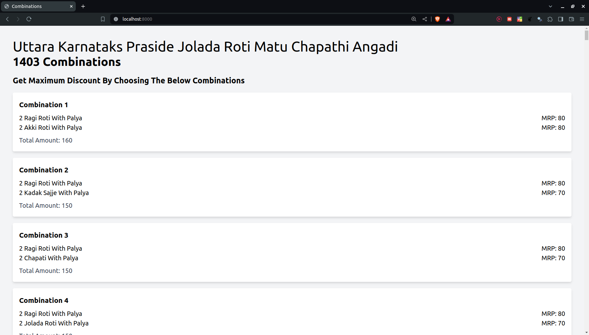

# MagicPin Combinations Finder
**This project finds the combinations of items with their total amount present in a particular restaurant. This is useful for finding the best combinations of food items that will get the best discount possible.**  

>It takes **MagicPin Restaurant URL**, **Total Amt** for which the combinations are needed to be calculated.  

>It can also take the **Percentage off** and **Upto** values and calculates the best deal possible.  
> It does it by using a formula:  
### **Total Amt = upto*100/percetage**
EX: Total Amt = 100*100/94 = 106

### **Click on the share button to get the link**

*This is only applicable for Food Delivery.*  

# Running Locally
## Requirements

`pip install -r requirements.txt`

> 1. Flask  
> `pip install flask`
>
> 2. Scrapy  
> `pip install scrapy`
>
> 3. Playwright  
> `pip install playwright`  
>
> 4. Gunicorn  
> `pip install gunicorn`
## Procedure
- Install all the requirements
- Run `playwright install` 
- Run `playwright install-deps` (if this doesn't work)
    - Change the browser from webkit to chromium inside scrapper2.py [this line](https://github.com/sai-ganesh-03/MagicPin_Combinations_Finder/blob/master/scrapper2.py#L22)  
    - browser = p.chromium.launch()
- Run `python3 server2.py` (Development Mode)
- The server will be listening at `http://localhost:8000`

## Production
`gunicorn -b 0.0.0.0:8000 wsgi:app`

# Running via Docker
- Build the docker image locally  
`sudo docker build -t magicpin_combinations .`  
- Run  
`sudo docker run -p 8000:8000 magicpin_combinations`  
 
OR
 

- Pull the prebuilt image from  
`sudo docker pull saiganesh003/magicpin_combinations`  
- Run  
`sudo docker run -p 8000:8000 saiganesh003/magicpin_combinations`  
